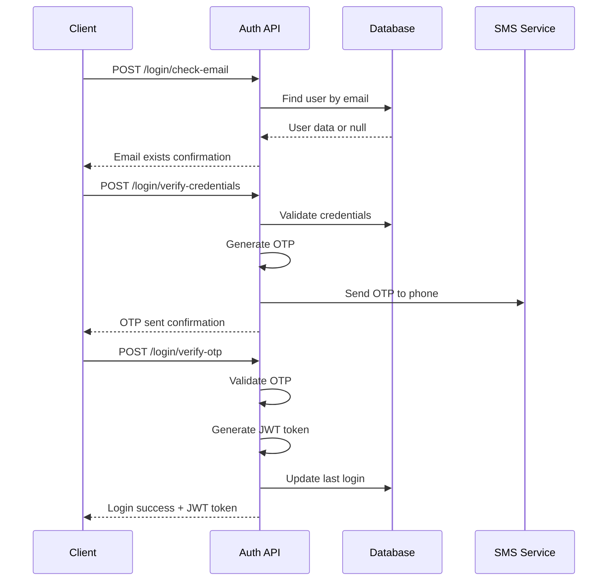

# Authentication Routes Documentation

## Overview
This document provides comprehensive documentation for all authentication routes in the CASH-DNR Backend system. The authentication system includes user registration, login with OTP verification, and various utility endpoints.

## Base URL
All authentication routes are prefixed with `/api/auth`

---

## 📋 Route Summary

| Method | Endpoint | Description | Access |
|--------|----------|-------------|---------|
| POST | `/citizen` | Register a new citizen (legacy route) | Public |
| POST | `/verify-id` | Verify South African ID with Home Affairs | Public |
| POST | `/register` | Main user registration with Home Affairs verification | Public |
| PUT | `/complete-profile` | Complete user profile with additional info | Private |
| POST | `/test-upload` | Test file upload functionality | Public |
| POST | `/register-with-documents` | Register user with document upload | Public |
| POST | `/login/check-email` | Check if email exists in database | Public |
| POST | `/login/verify-credentials` | Verify credentials and send OTP | Public |
| POST | `/login/verify-otp` | Verify OTP and complete login | Public |
| POST | `/login/resend-otp` | Resend OTP to user's phone | Public |

---

## 🔐 Authentication System Components

### OTP System
- **Storage**: In-memory Map (production should use Redis/database)
- **OTP Format**: 6-digit numeric code
- **Expiration**: 60 seconds
- **Max Attempts**: 3 attempts per session
- **SMS Integration**: Mock implementation (ready for Twilio/AWS SNS)

### JWT Tokens
- **Algorithm**: Default (HS256)
- **Expiration**: 24 hours
- **Secret**: Environment variable `JWT_SECRET`

---

## 📝 Route Details

### 1. POST `/citizen` - Legacy Citizen Registration
**Purpose**: Register a new citizen with basic information
**Access**: Public
**Content-Type**: application/json

#### Request Body:
```json
{
  "idNumber": "9105289012088",
  "contactInfo": {
    "email": "user@example.com",
    "phone": "+27 82 123 4567"
  },
  "homeAddress": {
    "streetAddress": "123 Main Street",
    "town": "Johannesburg",
    "city": "Johannesburg", 
    "province": "Gauteng",
    "postalCode": "2000"
  },
  "password": "securePassword123"
}
```

#### Response (201 - Success):
```json
{
  "success": true,
  "message": "Citizen registered successfully",
  "data": {
    "user": {
      "id": "uuid",
      "username": "generated.username",
      "email": "user@example.com",
      "firstName": "John",
      "lastName": "Doe",
      "idNumber": "9105289012088",
      "taxNumber": "generated-tax-number",
      "homeAffairsVerified": true,
      "isActive": true,
      "isVerified": false
    },
    "token": "jwt-token",
    "registrationComplete": true
  }
}
```

---

### 2. POST `/verify-id` - ID Verification
**Purpose**: Verify South African ID number with Home Affairs database
**Access**: Public
**Content-Type**: application/json

#### Request Body:
```json
{
  "idNumber": "9105289012088"
}
```

#### Response (200 - Success):
```json
{
  "success": true,
  "message": "ID verification successful",
  "data": {
    "idNumber": "9105289012088",
    "isValid": true,
    "isRegistered": false,
    "homeAffairsData": {
      "firstName": "John",
      "lastName": "Doe",
      "dateOfBirth": "1991-05-28",
      "gender": "Male"
    },
    "fallbackUsed": false
  }
}
```

---

### 3. POST `/register` - Main Registration
**Purpose**: Complete user registration with Home Affairs verification
**Access**: Public
**Content-Type**: application/json

#### Validation Rules:
- `idNumber`: Exactly 13 digits
- `email`: Valid email format
- `password`: Minimum 6 characters
- `phoneNumber`: 10-20 characters (optional)

#### Request Body:
```json
{
  "email": "user@example.com",
  "password": "securePassword123",
  "idNumber": "9105289012088",
  "homeAddress": {
    "streetAddress": "123 Main Street",
    "town": "Johannesburg",
    "city": "Johannesburg",
    "province": "Gauteng", 
    "postalCode": "2000"
  },
  "phoneNumber": "+27821234567"
}
```

#### Response (201 - Success):
```json
{
  "success": true,
  "message": "User registered successfully with Home Affairs and SARS verification",
  "data": {
    "user": {
      "id": "uuid",
      "username": "john.doe",
      "email": "user@example.com",
      "firstName": "John",
      "lastName": "Doe",
      "idNumber": "9105289012088",
      "dateOfBirth": "1991-05-28",
      "gender": "Male",
      "taxNumber": "generated-tax-number",
      "homeAffairsVerified": true,
      "isActive": true,
      "isVerified": false
    },
    "token": "jwt-token",
    "registrationComplete": true,
    "homeAffairsVerification": {
      "verified": true,
      "source": "home-affairs-api"
    }
  }
}
```

---

### 4. PUT `/complete-profile` - Profile Completion
**Purpose**: Add missing information to user profile
**Access**: Private (requires JWT token)
**Content-Type**: application/json
**Headers**: `Authorization: Bearer <jwt-token>`

#### Request Body:
```json
{
  "homeAddress": {
    "streetAddress": "123 Main Street",
    "town": "Johannesburg",
    "city": "Johannesburg",
    "province": "Gauteng",
    "postalCode": "2000"
  },
  "phoneNumber": "+27821234567"
}
```

---

### 5. POST `/register-with-documents` - Registration with File Upload
**Purpose**: Register user and upload required documents in one request
**Access**: Public
**Content-Type**: multipart/form-data

#### Form Fields:
- `email`: User email
- `password`: User password
- `idNumber`: South African ID number
- `phoneNumber`: Phone number (optional)
- `homeAddress`: JSON string of address object

#### File Fields:
- `id_document`: ID document files (max 5)
- `proof_of_residence`: Proof of residence files (max 5)  
- `bank_statement`: Bank statement files (max 5)
- `other_documents`: Other documents (max 20)

#### Response (201 - Success):
```json
{
  "success": true,
  "message": "User registered and documents uploaded",
  "data": {
    "user": {
      "id": "uuid",
      "username": "john.doe",
      "email": "user@example.com",
      "isVerified": true
    },
    "uploaded": [
      {
        "id": "file-uuid",
        "originalName": "id_document.pdf",
        "fileName": "generated-filename.pdf",
        "category": "id_documents"
      }
    ]
  }
}
```

---

## 🔑 Login Flow Routes

### 6. POST `/login/check-email` - Email Verification
**Purpose**: Check if email exists and account is active
**Access**: Public
**Content-Type**: application/json

#### Request Body:
```json
{
  "email": "user@example.com"
}
```

#### Response (200 - Email Found):
```json
{
  "success": true,
  "message": "Email found",
  "data": {
    "email": "user@example.com",
    "firstName": "John",
    "lastName": "Doe",
    "accountType": "individual"
  }
}
```

#### Response (404 - Email Not Found):
```json
{
  "success": false,
  "message": "No account found with this email address",
  "code": "EMAIL_NOT_FOUND"
}
```

---

### 7. POST `/login/verify-credentials` - Credential Verification
**Purpose**: Verify user credentials and send OTP
**Access**: Public
**Content-Type**: application/json

#### Request Body:
```json
{
  "email": "user@example.com",
  "identifier": "9105289012088",
  "password": "securePassword123"
}
```

#### Validation Rules:
- `identifier`: Must be 13-digit ID number OR business registration format
- `password`: Minimum 6 characters

#### Response (200 - Success):
```json
{
  "success": true,
  "message": "Credentials verified. OTP sent to your registered phone number.",
  "data": {
    "otpKey": "userId_timestamp",
    "phoneNumber": "***4567",
    "expiresIn": 60
  }
}
```

#### Error Codes:
- `ACCOUNT_NOT_FOUND`: User account doesn't exist
- `INVALID_IDENTIFIER`: ID/business number doesn't match
- `INVALID_PASSWORD`: Password is incorrect
- `NO_PHONE_NUMBER`: Account has no phone number
- `OTP_SEND_FAILED`: Failed to send SMS

---

### 8. POST `/login/verify-otp` - OTP Verification
**Purpose**: Verify OTP and complete login process
**Access**: Public
**Content-Type**: application/json

#### Request Body:
```json
{
  "otpKey": "userId_timestamp",
  "otp": "123456"
}
```

#### Response (200 - Success):
```json
{
  "success": true,
  "message": "Login successful",
  "data": {
    "user": {
      "id": "uuid",
      "username": "john.doe",
      "email": "user@example.com",
      "firstName": "John",
      "lastName": "Doe",
      "idNumber": "9105289012088",
      "accountType": "individual",
      "lastLogin": "2025-10-02T15:30:00.000Z"
    },
    "token": "jwt-token",
    "expiresIn": "24h"
  }
}
```

#### Error Codes:
- `INVALID_OTP_SESSION`: OTP key is invalid or expired
- `OTP_EXPIRED`: OTP has expired (60 seconds)
- `TOO_MANY_ATTEMPTS`: Exceeded 3 attempts
- `INVALID_OTP`: OTP code is incorrect
- `USER_NOT_FOUND`: User account was deleted

---

### 9. POST `/login/resend-otp` - Resend OTP
**Purpose**: Generate and send new OTP code
**Access**: Public
**Content-Type**: application/json

#### Request Body:
```json
{
  "otpKey": "userId_timestamp"
}
```

#### Response (200 - Success):
```json
{
  "success": true,
  "message": "New OTP sent to your registered phone number.",
  "data": {
    "phoneNumber": "***4567",
    "expiresIn": 60
  }
}
```

---

## 🔧 Utility Functions

### OTP Management
```javascript
// Generate 6-digit OTP
const generateOTP = () => Math.floor(100000 + Math.random() * 900000).toString();

// Send OTP via SMS (mock implementation)
const sendOTP = async (phoneNumber, otp) => {
  console.log(`📱 Sending OTP ${otp} to ${phoneNumber}`);
  return { success: true, message: 'OTP sent successfully' };
};
```

### Date Extraction from ID
```javascript
// Extract date of birth from SA ID number
const extractDateOfBirth = (idNumber) => {
  const year = idNumber.substring(0, 2);
  const month = idNumber.substring(2, 4); 
  const day = idNumber.substring(4, 6);
  const century = parseInt(year) <= new Date().getFullYear() % 100 ? '20' : '19';
  return `${century}${year}-${month}-${day}`;
};
```

---

## 🛡️ Security Features

### Password Security
- **Hashing**: bcrypt with 12 salt rounds
- **Minimum Length**: 6 characters
- **Storage**: Only hashed passwords stored

### OTP Security
- **Expiration**: 60 seconds timeout
- **Attempt Limit**: Maximum 3 attempts per session
- **Session Cleanup**: Automatic cleanup on success/failure
- **Rate Limiting**: Built-in attempt tracking

### Input Validation
- **Email**: Format validation and normalization
- **ID Numbers**: 13-digit South African format
- **Phone Numbers**: South African format validation
- **File Uploads**: Type, size, and quantity limits

### Authentication
- **JWT Tokens**: 24-hour expiration
- **Home Affairs Integration**: Real-time ID verification
- **SARS Integration**: Tax number generation and validation

---

## 📱 Integration Points

### Home Affairs API
- **Purpose**: Verify ID numbers and fetch personal details
- **Service**: `verifyIdWithHomeAffairs(idNumber)`
- **Data Retrieved**: Name, DOB, gender, citizenship status

### SARS API  
- **Purpose**: Tax compliance checking and number generation
- **Service**: `generateTaxNumber(idNumber)`, `sarsComplianceChecker`
- **Data**: Tax reference numbers, compliance status

### SMS Service
- **Current**: Mock implementation
- **Production Ready**: Twilio, AWS SNS integration hooks
- **Usage**: OTP delivery to registered phone numbers

---

## 🚨 Error Handling

### Common Error Responses

#### 400 - Bad Request
```json
{
  "success": false,
  "message": "Validation failed",
  "errors": [
    {
      "type": "field",
      "value": "invalid-email",
      "msg": "Valid email is required",
      "path": "email",
      "location": "body"
    }
  ]
}
```

#### 401 - Unauthorized
```json
{
  "success": false,
  "message": "Invalid password",
  "code": "INVALID_PASSWORD"
}
```

#### 404 - Not Found
```json
{
  "success": false,
  "message": "No account found with this email address", 
  "code": "EMAIL_NOT_FOUND"
}
```

#### 500 - Internal Server Error
```json
{
  "success": false,
  "message": "Internal server error during registration"
}
```

---

## 🔄 Login Flow Sequence



---

## 🔨 Development Notes

### File Upload Configuration
- **Middleware**: `express-fileupload`
- **Temp Directory**: `./tmp`
- **Size Limit**: 5MB per file
- **Allowed Types**: JPEG, PNG, PDF
- **Storage**: Local filesystem with database records

### Environment Variables Required
```env
JWT_SECRET=your-secret-key
NODE_ENV=development|production
DEV_DB_HOST=localhost
DEV_DB_NAME=cash_dnr_dev
DEV_DB_USER=your-user
DEV_DB_PASSWORD=your-password
```

### Production Considerations
1. **OTP Storage**: Replace in-memory Map with Redis
2. **SMS Service**: Configure Twilio or AWS SNS
3. **File Storage**: Consider cloud storage (AWS S3, Azure Blob)
4. **Rate Limiting**: Add API rate limiting middleware
5. **Logging**: Enhance security audit logging
6. **HTTPS**: Ensure all communications use HTTPS

---

This documentation covers all authentication routes and provides implementation details for frontend integration and system maintenance.
